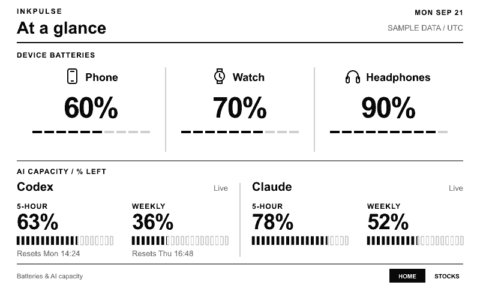

# InkPulse

An e-ink dashboard for device batteries, AI usage, and US stocks on a Seeed reTerminal E1001, crafted with GPT/Claude.



📖 [The story behind InkPulse](https://blog.kyrios.cn/2026-10-inkpulse/)

```sh
npm install
npm test                 # build and test; no credentials or hardware needed
npm run render:mock      # preview pages with fictional data in output/mock/
node --env-file=.env.local dist/apps/server/src/index.js   # run the server locally
npm run collect:ai       # run the PC collector (loads .env.local)
npm run deploy           # deploy the server: docs/deployment.md
npm run firmware:upload  # flash the E1001: firmware/e1001/README.md
```

Requires Node.js 22+ (CI uses 24).

## How it works

A PC collector uploads local AI-usage, battery, and presence summaries to an always-on server. The server
fetches stocks, renders 800 × 480 four-gray pages, and the E1001 downloads only changed images over Wi-Fi.
Stocks keep updating while the PC is off; AI and battery readings keep their last values with freshness labels.

- **Overview:** device batteries plus Codex/Claude capacity and reset times.
- **Stocks:** your watchlist, daily changes, and price trends.

Left/Right switch cached pages; Refresh checks the server. Unchanged images never redraw, and AFK holds
cut redraws further. The firmware stays awake and is meant for USB power.

## Configure

Copy settings from [.env.example](.env.example) into ignored local files; never commit secrets.

1. **Server:** set 1–12 `INKPULSE_STOCK_SYMBOLS` (no default) and two distinct tokens, display and AI ingest.
2. **PC:** set the ingest URL and token; optionally copy [battery.example.json](config/battery.example.json)
   to `config/battery.local.json`. Batteries and AFK detection need native Windows.
3. **E1001:** set Wi-Fi, the HTTPS origin, and the display token ([firmware guide](firmware/e1001/README.md)).

## Limits

- Device checks every 60 s; stocks refresh every 900 s from Yahoo's unofficial, keyless API (not trading-grade).
- Codex uses the local CLI sign-in; Claude reads Desktop's local usage cache, which can lag. Only normalized
  summaries leave the PC.
- Windows may round or cache battery values; disconnected readings stay visible for 48 hours.
- Not yet built: deep sleep, market-aware scheduling, authenticated stock providers, server metrics.

## Documentation

- [Collectors and data sources](docs/data-sources.md): setup, privacy, freshness, diagnostics
- [Deployment](docs/deployment.md): VPS, collector restart, monitoring
- [Display protocol](docs/display-protocol.md): API, image versions, AFK holds
- [Architecture](docs/architecture.md): components, failures, security
- [E1001 firmware](firmware/e1001/README.md): build, flash, buttons, refresh counters
- [Battery-life estimates](docs/battery-life.md): planning numbers for future sleep firmware

## License

[MIT](LICENSE)
